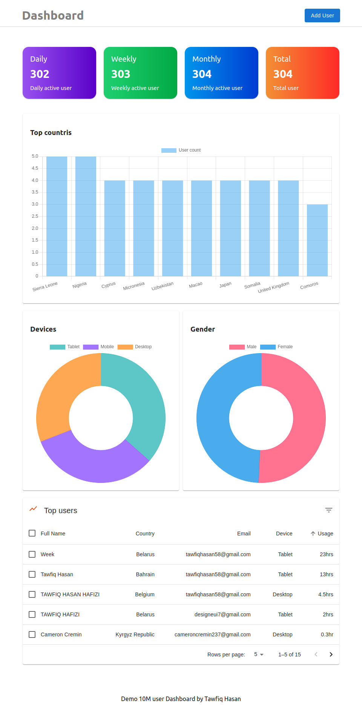
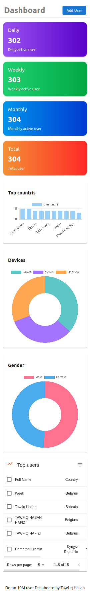
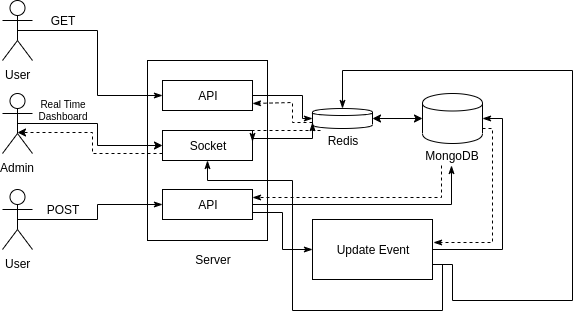

# MERN Real-time Dashboard with Redis

A webapp using MERN stack for a real-time dashboard to display user data.

## Live

Here is a live demo : [here](https://10md.thedeveloperx.com/)
<br/>
`NOTE:` If you add a new user and dashboard has already million users then it may
take a while to reflect that change on the dashboard because of this app architecture.

## Screenshot

<p align="center">
  
  
</p>
<br/>

## Built with

- [NextJs](https://nextjs.org/) - Fastest React framework that gives you building blocks to create web applications.
- [Express](https://expressjs.com/) - Express, is a back end web application framework for Node.js
- [MongoDB](https://www.mongodb.com/) - Fast and flexible NoSQL, document-oriented database.
- [Redis](https://redis.io/) - Redis is an open source, in-memory data structure store, used as a database, cache, and message broker.
- [ChartJs](https://www.chartjs.org/) - Free , Rich Data visualization library to visualize bar, line, area, pie, bubble, radar, polar, and scatter.
- [Styled-components](https://styled-components.com/) - Styled-components is a library built for React and React Native developers. It allows you to use component-level styles in your applications.
- [MUI](https://mui.com/) - MUI provides a simple, customizable, and accessible library of React components
- [Socket.IO](https://socket.io/) - Socket.IO is an event-driven library for real-time web applications.

<br/>

## System Design

This app usage `MongoDB` as primary database and `Redis` a cache database. Whenever a `user-event` happend like e.g. `create-user` with user data it will store it in the MongoDB database and then
fire an event-update method to automatically re-order and update dashboard status data to the Redis database and send a response to socket.io client who are listening for dashboard changes. But user who creates an account will not wait for this whole process rather he will get response immediately after storing data to MongoDB database. Thus the app will respond faster and also give real-time feature for the admin dashboard.
In a case if user request for data but Redis cache is empty then it
will fetch data from `MongoDB`, store it to the redis cache and then send response back to the user. This is a rare senario in this app but if this happend then the
request may take a while to get data from server but most of the time user will get data from Redis
cache.

<p align="center">
  
</p>

<br/>

## To run server

To start server first you need to install all the dependency

```
cd server
```

```
npm install
```

then run this command to start the server!

```
npm run start
```

<br/>

## To run next app

First go the react app directory by running this command

```
cd client
```

then for the first time install all the dependency

```
npm install
```

and then run this command to start your next app

```
npm run build
```

```
npm run start
```

<br/>

## Q. How to create fake user?

Use [Postman](https://www.postman.com/) to send a `POST` request to your server
with your fake user count you want to generate.

### example

```
POST: http://localhost:5000/api/faker/generate

{
  "userCount": 1000000
}
```

To clean database after testing use the example below.

### example

```
POST: http://localhost:5000/api/faker/clean

{}
```

<br/>

### License

<br/>

```
MIT License

Copyright (c) 2020 Tawfiq Hasan

Permission is hereby granted, free of charge, to any person obtaining a copy
of this software and associated documentation files (the "Software"), to deal
in the Software without restriction, including without limitation the rights
to use, copy, modify, merge, publish, distribute, sublicense, and/or sell
copies of the Software, and to permit persons to whom the Software is
furnished to do so, subject to the following conditions:

The above copyright notice and this permission notice shall be included in all
copies or substantial portions of the Software.

THE SOFTWARE IS PROVIDED "AS IS", WITHOUT WARRANTY OF ANY KIND, EXPRESS OR
IMPLIED, INCLUDING BUT NOT LIMITED TO THE WARRANTIES OF MERCHANTABILITY,
FITNESS FOR A PARTICULAR PURPOSE AND NONINFRINGEMENT. IN NO EVENT SHALL THE
AUTHORS OR COPYRIGHT HOLDERS BE LIABLE FOR ANY CLAIM, DAMAGES OR OTHER
LIABILITY, WHETHER IN AN ACTION OF CONTRACT, TORT OR OTHERWISE, ARISING FROM,
OUT OF OR IN CONNECTION WITH THE SOFTWARE OR THE USE OR OTHER DEALINGS IN THE
SOFTWARE.
```

MIT © [Tawfiq Hasan](https://github.com/TawfiqHasan58)
